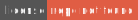

# lang-null 

<!-- Header Badges -->

  

 

  

<!-- End Header -->

Custom programming language using rust and nasm along with linkers appropriate for the OS.

<!-- Footer Badges --!>

 

  
  

<!-- End Footer -->
